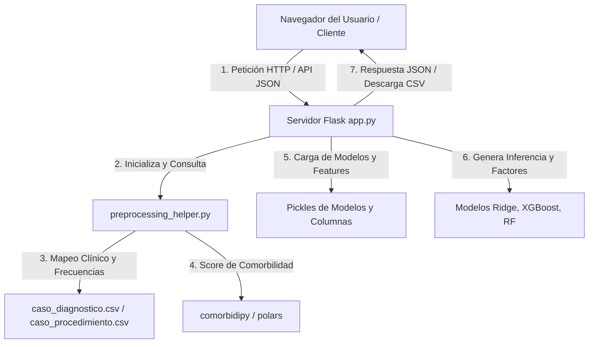

# Resumen Consolidado del Funcionamiento de la Aplicación Web (Stay Intelligence)
**Documento Técnico y Operacional Completo de Producción — Capstone Grupo 16**

Este documento detalla exhaustivamente la arquitectura, funcionalidades, tecnologías y el flujo de datos de la plataforma web de Inteligencia de Estancia Clínica desarrollada en la carpeta **`Web`**. La aplicación está diseñada para cargar modelos clínicos predictivos en memoria y realizar inferencias en tiempo real de la duración de estancia hospitalaria (*Length of Stay*, LOS) y el riesgo asociado de los pacientes.

---

## 1. Arquitectura General del Sistema

La solución está construida bajo una arquitectura de **Servicios Desacoplados y APIs RESTful**, utilizando un servidor backend en Python y una interfaz frontend dinámica basada en componentes HTML5/CSS3/JavaScript.



---

## 2. Tecnologías y Herramientas Utilizadas (Stack Tecnológico)

El entorno del sistema está definido en el archivo [`requirements.txt`](file:///C:/Users/tomas/Downloads/E3_Capstone/Capstone-Grupo-16--main/Web/requirements.txt) y emplea las siguientes herramientas:

*   **Flask (v3.0.x):** Micro-framework web síncrono encargado del enrutamiento HTTP, la gestión de sesiones de archivos, el procesamiento de archivos subidos y la publicación de los endpoints de la API.
*   **scikit-learn (v1.7.1/1.8.0):** Biblioteca utilizada para la carga e inferencia de los modelos de regresión lineal regularizada (Ridge) y ensambles (Random Forest) mediante la deserialización de archivos pickle (`.pkl`).
*   **xgboost (v2.0.x):** Framework de gradiente incrementado (Gradient Boosting) que ejecuta la inferencia del modelo clasificado como ganador general (XGBoost Regressor).
*   **pandas y numpy:** Librerías para el procesamiento de datos científicos, manipulación de dataframes y alineación de vectores multidimensionales en tiempo de ejecución.
*   **comorbidipy (v0.8.0) y polars:** Utilizados para el cálculo eficiente del Índice de Comorbilidad de Charlson. `comorbidipy` realiza la identificación de patologías crónicas mapeadas a ICD-10-CM basándose en la velocidad de ejecución en memoria de `polars`.
*   **HTML5, Vanilla CSS (estilo Google Stitch) y Tailwind CSS (CDN):** El frontend utiliza hojas de estilo CSS personalizadas que implementan un diseño de modo oscuro (*Dark Mode*) con efectos de *Glassmorphism* (desenfoque y transparencias), layouts responsivos y micro-animaciones fluidas en botones e inputs.
*   **JavaScript Asíncrono (ES6):** Controla la lógica de interfaz del usuario, realiza solicitudes a la API mediante la función nativa `fetch` (evitando recargar la página), y gestiona el autocompletado y el renderizado del DOM en caliente.

---

## 3. Servidor Backend (`app.py`)

El script principal [`app.py`](file:///C:/Users/tomas/Downloads/E3_Capstone/Capstone-Grupo-16--main/Web/app.py) expone las rutas del sistema y administra el ciclo de vida de los modelos.

### 3.1 Inicialización de Modelos y Features en Memoria
Al arrancar el servidor web, se ejecuta la función `cargar_modelos()`, la cual realiza una precarga de los archivos binarios serializados. Esto elimina la latencia de carga en disco durante las consultas HTTP. Se cargan los siguientes elementos:

1.  **Modelos de Aprendizaje Avanzado (Inferencia Global):**
    *   `xgb_model`: Cargado desde `ml/modelos/XGB/final/xgboost_final.pkl`.
    *   `rf_model`: Cargado desde `ml/modelos/RF/final/random_forest_final.pkl`.
2.  **Modelos Lineales Regularizados (Inferencia de Explicabilidad y Segmentada):**
    *   `lr_urg_model`: Cargado desde `Modelo_Base_Ultima entrega/lr_base_Urgencias.pkl`.
    *   `lr_nurg_model`: Cargado desde `Modelo_Base_Ultima entrega/lr_base_No_Urgencias.pkl`.
3.  **Listas de Variables Clínicas (Features):**
    *   `xgb_cols`: Columnas de entrada de XGBoost/RF (desde `Web/columnas_modelo_final.pkl`).
    *   `lr_urg_cols` / `lr_nurg_cols`: Columnas de regresión Ridge de Urgencias y No Urgencias, respectivamente.

### 3.2 Rutas de Navegación (HTML Vistas)
*   `GET /`: Sirve el template `individual.html` correspondiente al censo de inferencia individual.
*   `GET /bulk`: Sirve el template `bulk.html` correspondiente a la carga masiva y censo de pacientes por CSV.
*   `GET /analytics`: Sirve el template `analytics.html` correspondiente al panel analítico de capacidad de camas del hospital.

### 3.3 Endpoints expuestos de la API JSON
*   `POST /charlson`: Recibe una lista de diagnósticos en formato JSON y devuelve el índice de Charlson acumulado.
*   `POST /predict`: Recibe el perfil clínico de un paciente en JSON, genera los vectores correspondientes, predice a través de los modelos disponibles ( Ridge, XGBoost, Random Forest ), mapea los coeficientes para la explicabilidad y devuelve el diagnóstico completo de estancia.
*   `POST /predict-bulk`: Recibe un archivo CSV subido por el usuario, procesa y predice la estancia de cada fila y guarda el resultado en el disco, devolviendo las primeras 50 predicciones en JSON para visualización inmediata en pantalla.
*   `GET /export-bulk/<batch_id>`: Envía al cliente el archivo CSV final almacenado temporalmente con las predicciones del modelo y el índice de Charlson calculado anexados.
*   `GET /download-template`: Genera y descarga un archivo CSV plantilla con la estructura correcta de cabeceras clínicas requerida por el preprocesamiento del lote.

---

## 4. Pipeline de Preprocesamiento (`preprocessing_helper.py`)

El archivo [`preprocessing_helper.py`](file:///C:/Users/tomas/Downloads/E3_Capstone/Capstone-Grupo-16--main/Web/preprocessing_helper.py) replica con precisión la transformación de variables clínicas realizada durante el entrenamiento de los modelos de Machine Learning.

### 4.1 Inicialización de Frecuencias Históricas
Al importar el módulo, se invoca `inicializar_frecuencias()`, que lee `caso_diagnostico.csv` y `caso_procedimiento.csv` (ubicados en `data/processed/`) y construye diccionarios en memoria RAM con las frecuencias de aparición únicas de cada diagnóstico y procedimiento. Esto define la estructura jerárquica de agrupación.

### 4.2 Lógica de Mapeo Jerárquico (Soporte Mínimo)
El pipeline implementa una compresión en caliente para evitar la dispersión (*sparsity*) de los códigos:

*   **Diagnósticos (ICD-10-CM):**
    *   *Nivel 1 (Código Completo):* Si el código ingresado (ej. `E11.9`) tiene un soporte histórico $\ge 20$ casos, se mapea a la columna `diag_E119`.
    *   *Nivel 2 (Categoría de 3 caracteres):* Si tiene $< 20$ casos, se trunca a sus primeros 3 caracteres (ej. `E11`). Si la categoría tiene un soporte histórico $\ge 20$ casos, se mapea a `diag_E11`.
    *   *Nivel 3 (Capítulo General):* Si la categoría tampoco tiene soporte suficiente, se mapea al capítulo diagnóstico correspondiente a la letra inicial (ej. `diag_rare_cap_E`).
*   **Procedimientos (ICD-10-PCS):**
    *   *Nivel 1 (Código Completo):* Si el código del procedimiento (ej. `0BB64ZZ`) tiene soporte histórico $\ge 10$ casos, se mapea a `proc_0BB64ZZ`.
    *   *Nivel 2 (Categoría de 3 caracteres):* Si tiene $< 10$ casos, se trunca a sus primeros 3 caracteres (ej. `0BB`). Si la categoría tiene soporte $\ge 20$ casos, se mapea a `proc_0BB`.
    *   *Nivel 3 (Sección General):* Si falla el soporte, se mapea a su sección general según el primer dígito (ej. `proc_rare_sec_0`).

### 4.3 Cálculo Dinámico de Comorbilidad (Índice de Charlson)
Utiliza la biblioteca `comorbidipy` configurada con la variante de Quan (`variant='quan'`) y el estándar de códigos `icd10`. Procesa los diagnósticos sanitizados y determina un entero que representa la severidad de las comorbilidades crónicas del paciente.

### 4.4 Construcción y Alineación de Vectores de Entrada
1.  **Vectores para XGBoost/RF:** La función `construir_vector_paciente` crea un dataframe de una sola fila inicializado en ceros. Extrae variables estructurales (`n_procedimientos`, `n_diag_total`, `tiene_diag_primario`, `mes_ingreso`, `dia_semana_ingreso`, `charlson_index` y `es_urgencia`). Posteriormente, mapea jerárquicamente cada diagnóstico y procedimiento ingresado, marcando las columnas resultantes con valor $1$. Finalmente, reordena y alinea las columnas del dataframe para que coincidan exactamente con la estructura de variables guardada en `xgb_cols`.
2.  **Vectores para Regresión Ridge:** La función `construir_vector_paciente_lr` replica la lógica anterior pero introduce de forma explícita los **términos de interacción clínica** de segundo orden calculados:
    *   `int_charlson_diag = charlson_index * n_diag_total`
    *   `int_charlson_proc = charlson_index * n_procedimientos`
    *   `int_proc_diag = n_procedimientos * n_diag_total` *(Este término solo se añade si el paciente es clasificado en el segmento de Urgencias, eliminándose en No Urgencias para evitar ruido).*
    *   Alinea las columnas resultantes con las esperadas por el modelo Ridge activo.

---

## 5. Algoritmo de Explicabilidad Clínica (Driving Factors)

En el endpoint `/predict`, cuando se utiliza el modelo de Regresión Ridge, el servidor calcula de manera dinámica los factores de decisión clínica. Esta funcionalidad actúa como un modelo explicativo local:

1.  **Extracción de Coeficientes:** El servidor extrae el vector de pesos del modelo Ridge correspondiente: $\mathbf{w}$ (los coeficientes beta).
2.  **Cálculo de Aportes:** Multiplica cada valor de característica del paciente ($x_i$, que puede ser binaria $0/1$ o variables continuas de conteo e interacción) por su coeficiente correspondiente ($w_i$). El aporte de la variable $i$ a la predicción final en el espacio logarítmico es:
    $$\text{Contribución}_i = x_i \times w_i$$
3.  **Ordenamiento:** Se filtran las variables activas ($x_i \ne 0$) y se ordenan de forma descendente según su valor absoluto de contribución ($|\text{Contribución}_i|$).
4.  **Traducción Médica:** El sistema toma las 4 variables con mayor impacto absoluto y traduce sus códigos técnicos a descripciones clínicas legibles para el usuario:
    *   `charlson_index` $\rightarrow$ "Índice de comorbilidades clínicas".
    *   `int_charlson_diag` $\rightarrow$ "Interacción Comorbilidad × Diagnósticos".
    *   Códigos jerárquicos (ej. `diag_E11`) $\rightarrow$ Muestra el código traducido con su descripción correspondiente.
5.  **Cálculo de Impacto en Días:** Se calcula el impacto aproximado que tuvo esa variable en la predicción final aplicando la exponencial del aporte absoluto:
    $$\text{Impacto en Días} = e^{|\text{Contribución}_i|} - 1$$
    Devuelve la dirección del impacto (aumento $+$ o disminución $-$ de la estancia).

---

## 6. Módulos y Funcionalidades del Frontend

La interfaz de usuario implementa tres flujos operativos definidos de trabajo:

### 6.1 Módulo de Predicción Individual (`individual.html`)
*   **Formulario Dinámico:** Permite ingresar la fecha de ingreso, seleccionar el tipo de admisión (Urgencias / Programado) y definir el modelo predictivo que controlará el resultado (XGBoost, Random Forest o Ridge).
*   **Buscador y Listas Dinámicas:** Permite añadir múltiples diagnósticos y procedimientos clínicos mediante un campo interactivo.
*   **Inferencia en Tiempo Real de Charlson:** Lanza solicitudes en segundo plano a la API de Charlson cada vez que se modifica la lista de diagnósticos, actualizando un indicador visual de comorbilidad en la interfaz.
*   **Panel de Resultados e Impacto:** Presenta la estancia estimada del paciente y la clasifica visualmente con un semáforo clínico de nivel de riesgo (Bajo $<6$ días, Moderado $6-14$ días, Elevado $\ge 14$ días). Adicionalmente, muestra un gráfico de barras horizontales animado con los factores clínicos explicativos calculados.
*   **Comparador Multi-Modelo:** Muestra en un panel lateral los días estimados calculados en paralelo por las otras arquitecturas de modelos, lo que permite al médico contrastar las predicciones.

### 6.2 Módulo de Predicción Masiva / Censo (`bulk.html`)
*   **Carga de Archivo CSV:** Interfaz para cargar rosters de pacientes. Cuenta con un validador que detecta si el archivo posee las cabeceras requeridas.
*   **Plantilla de Ejemplo:** Enlace directo para descargar una plantilla CSV estructurada correctamente.
*   **Procesamiento Asíncrono por Lotes:** Envía el archivo al servidor. La pantalla muestra un indicador de carga mientras el backend procesa los pacientes uno por uno.
*   **Visualización de Resultados:** Muestra una tabla con los primeros 50 pacientes inferidos, indicando su ID, el diagnóstico primario, el índice de Charlson calculado y la estancia predicha con su respectivo riesgo.
*   **Descarga de Resultados:** Habilita un botón para descargar el CSV resultante con las predicciones del modelo anexadas.

### 6.3 Dashboard Clínico (`analytics.html`)
*   **Indicadores Clave de Rendimiento (KPIs):**
    *   *Capacidad del Hospital:* Camas ocupadas vs. disponibles, calculadas a partir del censo procesado.
    *   *Estancia Promedio General (ALOS):* Media de días estimados de estancia.
    *   *Pacientes de Alto Riesgo:* Total y porcentaje de pacientes que superan el umbral crítico de hospitalización.
*   **Gráficos Interactivos:**
    *   *Distribución de Estancia:* Histograma de frecuencia de pacientes por tramos de estancia estimada (0-2, 3-6, 7-13, 14-26, 27+ días).
    *   *Distribución de Riesgo:* Gráficos de pastel que segmentan la población de pacientes en riesgo Bajo, Medio y Alto.

---

## 7. Estructura de Directorios del Componente Web

El directorio `Web/` está estructurado de manera limpia y modular:

```text
Web/
├── app.py                      # Servidor backend Flask y definición de endpoints
├── preprocessing_helper.py     # Lógica de preprocesamiento, Charlson y mapeo jerárquico
├── requisitos.txt              # Dependencias del entorno de Python
├── columnas_modelo_final.pkl   # Nombres y orden de las 1,651 variables de XGBoost/RF
├── templates/                  # Carpetas de vistas renderizadas por Jinja2
│   ├── individual.html         # Interfaz para predicciones individuales y explicabilidad
│   ├── bulk.html               # Interfaz para predicciones masivas de archivos CSV
│   └── analytics.html          # Panel analítico y KPI de ocupación hospitalaria
└── uploads/                    # Carpeta temporal para guardar CSVs cargados y descargados
```
