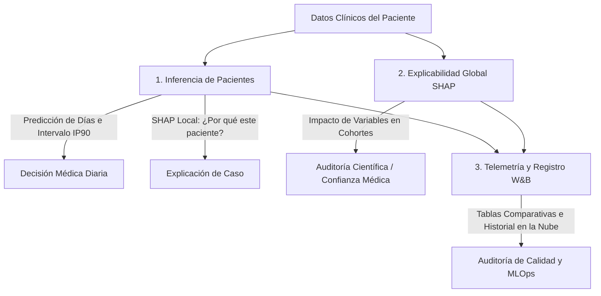

# 🏥 Stay Intelligence — Manual de Componentes Operativos
## Inferencia Clínica, Explicabilidad Global (SHAP) y Telemetría de Modelos (W&B)

Este documento describe de forma sencilla, profesional y estructurada el funcionamiento de los tres componentes clave desarrollados en el proyecto **Stay Intelligence**. El objetivo principal del proyecto es **predecir la estancia hospitalaria de los pacientes (en días)** e **identificar tempranamente a aquellos con riesgo de hospitalización prolongada (14 días o más)** para optimizar la gestión de camas y recursos médicos.

---

## 📌 Mapa General del Flujo de Datos

El siguiente diagrama muestra cómo interactúan las tres herramientas con los datos del paciente y los modelos entrenados:

---

## 🔬 1. Inferencia de Pacientes (Individual & Holdout)
*El asistente de toma de decisiones para el día a día en el hospital.*

### ¿Qué es?
Es la herramienta clínica principal orientada al personal de salud y administrativos del centro médico. Permite evaluar en tiempo real a cualquier paciente que ingrese al hospital (o consultar casos históricos del conjunto de prueba/holdout) para planificar su alta.

### ¿Cómo funciona internamente?
El sistema utiliza una arquitectura de **dos etapas**:
1. **Etapa 1 (Clasificación de Riesgo):** Un modelo clasificador analiza el perfil clínico del paciente y calcula la probabilidad de que su estancia sea prolongada ($\ge 14$ días). Esto activa un semáforo de riesgo:
   * 🟢 **Bajo Riesgo:** Probabilidad menor al 35%. Estancia corta estimada.
   * 🟡 **Riesgo Moderado:** Probabilidad entre 35% y 50%. Requiere monitoreo preventivo.
   * 🔴 **Riesgo Elevado:** Probabilidad mayor al 50%. Paciente con alta probabilidad de cronificación.
2. **Etapa 2 (Predicción de Días):** Dependiendo del perfil del paciente, se ejecutan en paralelo tres algoritmos distintos para estimar el número exacto de días de estancia:
   * **XGBoost (Modelo Ganador):** El modelo principal optimizado para patrones complejos no lineales.
   * **Random Forest:** Modelo alternativo basado en ensambles de árboles de decisión.
   * **Regresión Ridge:** Un modelo lineal regularizado usado como línea base científica.

### Características Clínicas Clave en la Interfaz:
* **Intervalo de Predicción Empírico al 90% (IP90):** La medicina no es exacta. En lugar de dar solo un número fijo, el sistema calcula un rango seguro (ej. *"se estima una estancia de 5 días, pero con un 90% de confianza real estará entre 3 y 8 días"*).
* **SHAP Local (Waterfall Plot):** Un gráfico que desglosa en tiempo real exactamente qué factores del paciente modificaron su predicción (ej. *"este paciente sumó +1.5 días debido a su índice de Charlson y restó -0.8 días por su tipo de procedimiento"*).

---

## 🌍 2. Explicabilidad Global - SHAP Dinámico
*La herramienta de validación científica y confianza médica.*

### ¿Qué es?
Mientras que la inferencia individual mira a un solo paciente, la explicabilidad global analiza el comportamiento del modelo XGBoost sobre **muestras masivas de la población** (cohortes de pacientes). Permite abrir la "caja negra" del algoritmo de Inteligencia Artificial.

### ¿Cómo funciona?
Utiliza la teoría de juegos cooperativos (valores SHAP) mediante el optimizador de árboles `TreeExplainer`. En la interfaz, el usuario puede seleccionar dinámicamente cuántos pacientes del historial desea auditar (de 10 a 400 pacientes) para generar dos análisis fundamentales:

1. **Gráfico Beeswarm (Summary Plot):**
   * Muestra las variables clínicas ordenadas de arriba a abajo por su nivel de importancia en todo el hospital.
   * Cada punto en el gráfico representa a un paciente real. El color (de azul a rojo) indica si el valor de la variable de ese paciente era bajo o alto.
   * *Ejemplo clínico:* Si la variable `charlson_index` en color rojo (alto) se desplaza a la derecha, significa que tener más comorbilidades incrementa sustancialmente los días de estancia estimados en toda la cohorte.
2. **Gráfico de Dependencia (Scatter Plot):**
   * Grafica de forma continua cómo influye una variable numérica sobre el valor SHAP (impacto en días). Es ideal para auditar cómo interactúa la probabilidad de la Etapa 1 con la estimación final de días de la Etapa 2.

### ¿Para qué sirve?
Garantiza que el modelo está aprendiendo medicina real y no correlaciones absurdas. Si los médicos ven que las variables que más importan al modelo coinciden con la literatura clínica (como la edad o comorbilidades graves), confiarán en las predicciones diarias del sistema.

---

## 📊 3. Telemetría y Registro - Weights & Biases (W&B)
*El cuaderno de bitácora digital, control de calidad y auditoría de MLOps.*

### ¿Qué es?
Weights & Biases (W&B) actúa como la **caja negra de un avión** para el ciclo de vida del modelo de IA. En entornos clínicos regulados, no basta con que un modelo funcione; es obligatorio auditar y registrar de forma inalterable su comportamiento a lo largo del tiempo.

### ¿Cómo funciona y qué registra?
Cada vez que se realiza una auditoría formal del rendimiento de los modelos en el conjunto de prueba (holdout) a través de la aplicación, el script `registro_wandb.py` envía la siguiente telemetría a la nube de W&B:

1. **Curvas de Aprendizaje Iterativas (Epoch Logging):**
   * Registra el proceso de entrenamiento de la regresión lineal Ridge paso a paso (MAE y Pérdida por cada época). Esto genera bonitas curvas continuas en la nube para asegurar que el modelo convergió de forma estable sin sobreajustarse.
2. **Tablas Comparativas de Modelos (`wandb.Table`):**
   * En lugar de registrar métricas de evaluación final como números sueltos (lo cual crea gráficos de líneas vacíos de un solo punto), las agrupa en tablas interactivas.
   * Puedes ver y ordenar en la nube el MAE, RMSE y métricas de clasificación (Recall, Precision, F1-Score) de los 3 modelos para compararlos de un vistazo.
3. **Gráficos de Diagnóstico Clínico:**
   * **Curva ROC interactiva:** Mide la capacidad del clasificador de riesgo para discriminar entre pacientes de alta y baja estancia a diferentes umbrales.
   * **Matriz de Confusión interactiva:** Permite visualizar los aciertos, falsos positivos (falsas alarmas de alto riesgo) y falsos negativos (pacientes de alto riesgo no detectados), cruciales para evaluar el impacto clínico del sistema.

### ¿Para qué sirve?
* **Trazabilidad:** Si una auditoría hospitalaria cuestiona una decisión del modelo, en W&B queda el registro inalterable de qué versión del modelo se usó y cuál era su precisión exacta en esa fecha.
* **Monitoreo de Degradación (Drift):** Si con el paso de los meses las métricas de error (MAE) en W&B empiezan a subir, el equipo de desarrollo sabrá inmediatamente que los datos de los pacientes han cambiado y que es hora de reentrenar los modelos.
